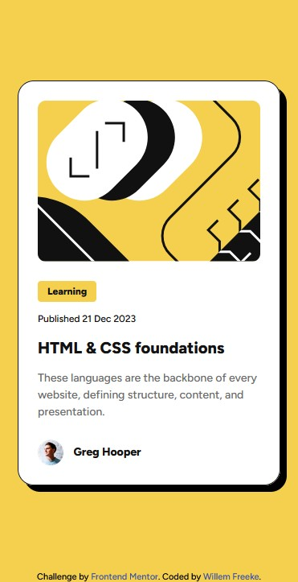
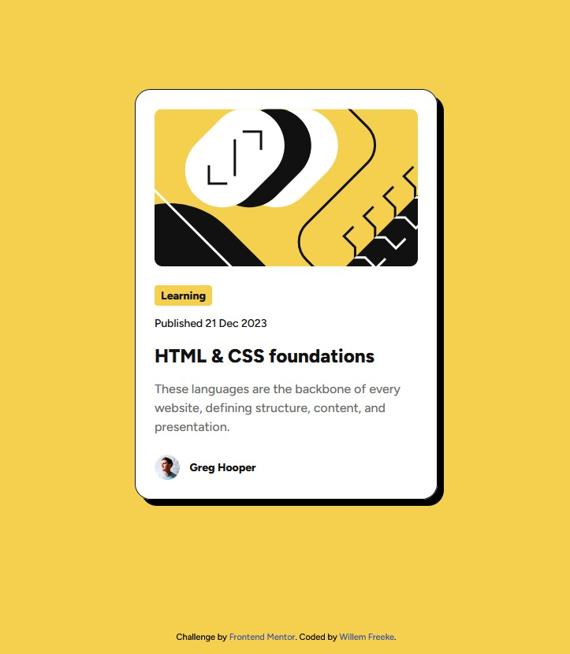
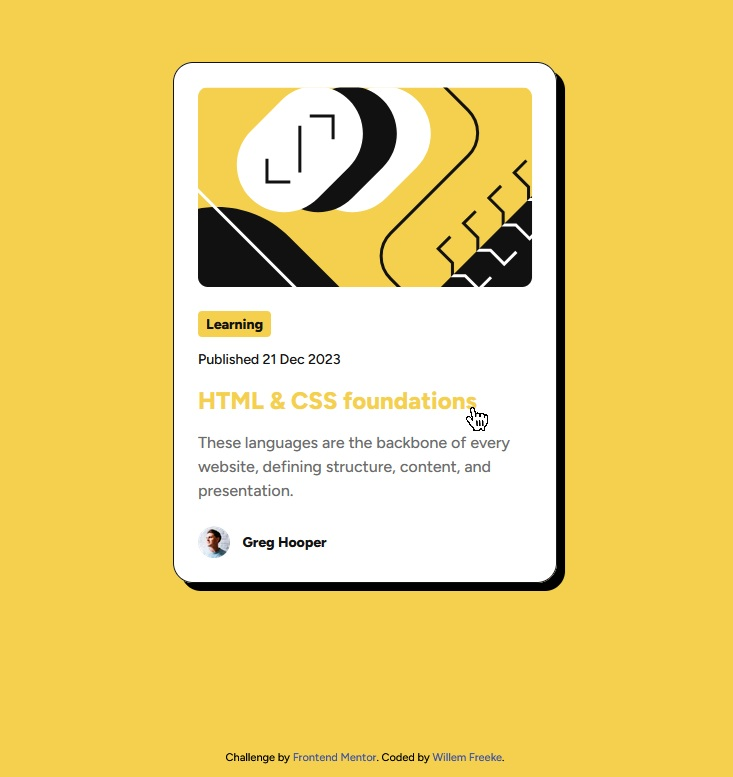

# Frontend Mentor - Blog preview card solution

This is a solution to the [Blog preview card challenge on Frontend Mentor](https://www.frontendmentor.io/challenges/blog-preview-card-ckPaj01IcS). Frontend Mentor challenges help you improve your coding skills by building realistic projects. 

## Table of contents

- [Overview](#overview)
  - [The challenge](#the-challenge)
  - [Screenshot](#screenshot)
  - [Links](#links)
- [My process](#my-process)
  - [Built with](#built-with)
  - [What I learned](#what-i-learned)
- [Author](#author)
- [Acknowledgments](#acknowledgments)

## Overview

### The challenge

Users should be able to:

- See hover and focus states for all interactive elements on the page

### Screenshot

### Links

- Live Site URL: https://freki-inc.github.io/Blog-Preview-Card/

## My process

### Built with

- Semantic HTML5 markup
- CSS custom properties
- Flexbox
- Mobile-first workflow

### What I learned

I learned to properly display SVG files, which can be tricky. I had to use stackoverflow.com to research how to display the SVG image in the way I wanted to using border-radius. 

## Author

- Website - https://www.willemwebdev.com/index.html
- Frontend Mentor - https://www.frontendmentor.io/profile/freki-inc
- Twitter - https://www.twitter.com/willemwebdev

## Acknowledgments

I would like to thank all the makers of the courses I studied with like Freecodecamp.org, codecademy.com and all the youtube channels that helped me understand webdevelopment coding and programming.
